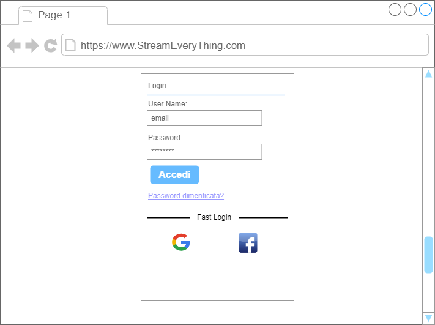
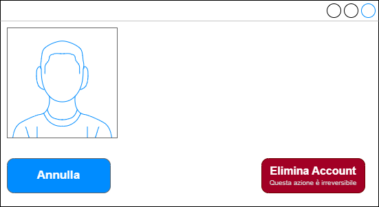

# Caso d'Uso: Login

## Breve Descrizione: 
Il caso d'uso permette all'utente di effettuare il login al proprio account.

## Attori primari:
- UtenteRegistrato

## Attori secondari: 
- Google
- Facebook

## Precondizioni:
- L'utente è registrato.
- L'utente non ha ancora effettuato il login.

## Sequenza degli eventi principale:
1. L'utente clicca sul pulsante "Login".

2. Viene mostrato un popup per eseguire il login nelle 3 modalità previste:
    - Inserimento di email e password
    - Login con Google
    - Login con Facebook

3. Se l'utente sceglie di effettuare il login con email e password:
        
    3.1. L'utente inserisce la propria email.

    3.2. L'utente inserisce la propria password.

    3.3. L'utente clicca su "Accedi".
        
    3.4. Se l'utente ha inserito email o password errati:

        3.4.1. Viene mostrato un messaggio di errore.

4. Se l'utente sceglie di fare il login con email e password, ma non si ricorda la password:

    4.1 L'utente clicca il tasto "Password Dimenticata"

    4.2 L'utente inserisce una nuova password 

    4.3 L'utente inserisce nuovamente la password 

    4.4 Se le due password non corrispondono 

        4.4.1 Viene mostrato un messaggio di errore

5. Se l'utente sceglie di effettuare il login con Google:
            
    5.1. L'utente clicca sul logo di Google, nella sezione "Fast Login" .
        
    5.2. Se l'utente non ha effettuato il login con successo:

        5.2.1. Viene mostrato un messaggio di errore.

6. Se l'utente sceglie di effettuare il login con Facebook:
                
    6.1. L'utente clicca sul logo di Facebook, nella sezione "Fast Login".
        
    6.2. Se l'utente non ha effettuato il login con successo:
    
        6.2.1. Viene mostrato un messaggio di errore.

7. Il popup viene chiuso e l'utente autenticato viene reindirizzato alla pagina precedentemente visitata.

## Postcondizioni:
- L'utente ha effettuato il login e può accedere alla sua area privata.

## Sequenza degli eventi alternativa:
- Se l'utente decide di annullare l'operazione di login, l'operazione fallisce e l'utente rimane non autenticato.

# 

# Caso d'Uso: CancellazioneAccount

## Breve Descrizione: 
Il caso d'uso permette all'utente di cancellare il proprio account.

## Attori primari:
- UtenteRegistrato
- UtentePremium

## Attori secondari: 
- Nessuno

## Precondizioni:
- Nessuna

## Sequenza degli eventi principale:
1. L'utente clicca sulle impostazioni.
2. L'utente clicca su "Cancella Account".
3. Se l'utente non ha già effettuato il login:
        
    3.1. Fintantochè l'utente non effettua il login con successo:
        
        3.1.1. L'utente effettua il login (Login).
        
4. L'utente clicca su "Conferma Eliminazione Account".
        
     
## Postcondizioni:
- L'account dell'utente è stato cancellato.
- L'utente viene reindirizzato alla pagina principale.

## Sequenza degli eventi alternativa:
- Se l'utente decide di annullare l'operazione di cancellazione dell'account, l'account non verrà cancellato.

