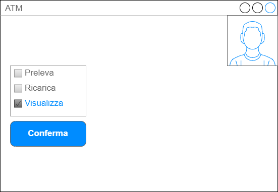

# Caso d'uso Preleva Contante 
## Breve descrizione:
l'utente desidera prelevare contante
## Attori Primari:
- Utente
## Attori Secondari:
- Bank System
## Precondizioni
nessuna
## Scenario principale di successo:
1. L'utente si autentica nel sistema
([Autenticati](...))
2. Il sistema visualizza la schermata principale

3. L'utente sceglie l'opzione per prelevare contante
4. Il sistema chiede l'ammontare da prelevare
5. L'utente inserisce l'ammontare 
6. Il sistema interroga il Bank System per il saldo 5
7. Il Bank System fornisce il saldo
8. Se il saldo è sufficiente, il sistema eroga il denaro all'utente
9. Altrimenti,
    
    9.1 Il sistema segnala che il saldo non è sufficiente
## Postcondizioni: ... 
## Scenari alternativi:
autenticazioneFallita
ammontareErrato, ..     

## Commenti: 
Con il mockup vado a modellare qualche scenario (es passo 2)